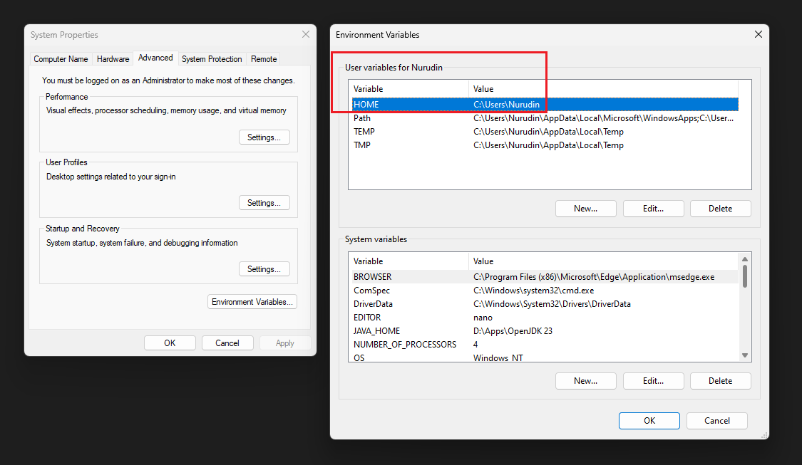

# [imshvc's dotfiles](../README.md) &gt; **MSYS2**

## Disclaimer: Windows users only

Before overwriting your dotfiles with these modified
configurations, make sure you set your user a HOME
variable pointing to your home directory

> Example: HOME = C:\Users\Nurudin

I do it this way because it's more intuitive
than to manage two directories separately.
